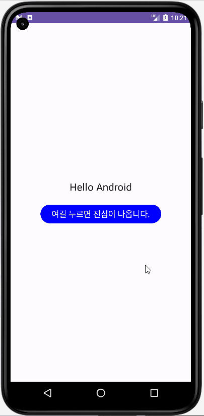

## Jetpack Compose, MVVM 적용된 안드로이드 공식 추천 앱 클론코딩

### 직접 구현하여 학습한 내용
com.jetpackPractice.jetpackcomposeclonecoding.myMVVMPractice 이하의 클래스들 구현<br>

구현 내용 : JetpackCompose에 MVVVM 패턴을 적용하여 ViewModel에 변화가 발생하면 UI가 변하는 기능을 수행




##  클론코딩 학습 내용

myMVVMPractice 제외한 com.jetpackPractice.jetpackcomposeclonecoding 패키지에 존재하는 클래스들은 
[Android Developers](https://developer.android.com)에서 추천하는 샘플들을 클론코딩하면서 배웠던 내용 정리
### 1. ui.theme 패키지
Jetpack Compose Activity 생성 시 같이 생성되는 ui.theme 패키지에는 Color.kt, Theme.kt, Type.kt가 있습니다.<br>

----

#### Color.kr : 색상을 정의하여 상수와 같이 사용할 수 있습니다.
```
val Yellow = Color(0xFFFFCB66)
val White = Color(0xFFFFFFFF)
val MintGreen = Color(0xFFACD6B8)
```
위의 코드를 Color.kt 내용에 추가하면 같은 패키지 내에서는 상수 값으로 그대로 Yellow라고 하면 색상을 불러올 수 있습니다.<br><br>
다른 패키지에서 사용하려면 import "나의 패키지명".ui.theme.White(사용할 색상) White를 상수처럼 사용할 수 있습니다.<br><br>

----

#### Theme.kt : 안드로이드 테마를 정할 수 있습니다. Dark모드, white모드의 각각 색상을 정해줄 수 있습니다.


<details>
<summary> 사용자가 Override가능한 색상은 다음과 같습니다.</summary>

```
primary : 앱의 탭, 바 등의 주요 UI 구성요소 색상을 정의합니다.

secondary : 2번째로 주요 사용되는 UI 요소 색을 정의합니다.

tertiary : 3번째로 주요 UI요소 색상을 정의합니다.

background : 배경색을 정의할 수 있습니다.

surface : 카드  또는 패널에 사용되는 색상을 정의합니다.

onPrimary : primary 배경 위의 텍스트, 아이콘 등의 색상을 정의합니다.

onSecondary : secondary 배경 위의 텍스트, 아이콘 등의 색상을 정의합니다.

onTertiary : tertiary 배경 위의 텍스트, 아이콘 등의 색상을 정의합니다.

onBackground : background 위의 텍스트, 아이콘 등의 색상을 정의합니다.

onSurface : surface 위의 텍스트, 아이콘 등의 색상을 정의합니다.
```
</details><br>

----

#### Type.kt : 안드로이드 텍스트의 사이즈, 폰트 등을 한번에 정의하여 하나의 상수로 사용할 수 있습니다.

```
val TitleBarStyle = TextStyle(
    fontSize = 22.sp,
    fontWeight = FontWeight(700),
    letterSpacing = 0.5.sp,
    fontFamily = fontFamily
)
```
위와 같은 코드를 추가하면 TitleBarStyle을 불러와 Text에 쉽게 적용할 수 있습니다.

## 개념 및 실습 공부를 위해 참고한 사이트
### JetPack Compose 개념
https://developer.android.com/jetpack/compose/tutorial?hl=ko
https://developer.android.com/jetpack/compose/tooling/previews?hl=ko

### @PreviewParameter 사용법
https://stackoverflow.com/questions/66375086/how-to-use-the-previewparameter-annotation

