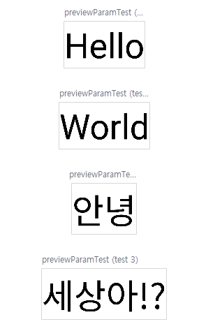

# ToyMVVMApp
### MVVM, Corutin 학습용 앱
#### Jetpack Compose 기초 공부

Jetpack Compose 학습 및 클론 코딩 실습

### Jetpack Compose란?

        안드로이드 스튜디오의 기본적으로 XML을 이용하여 UI를 꾸미게 되어있었는데
        Jetpack Compose는 Android UI를 빌드하기 위한 최신 도구 키트입니다.
        더 적은 수의 코드, 직관적인 Kotlin API와 선언형 함수를 사용하여 UI 구성요소를 빌드합니다.

        즉 XML이 아닌 코드를 이용하여 더욱 편한게 UI를 꾸미기 위한 툴킷 입니다!

#### @Composable

        Jetpack은 함수를 UI 구성에 사용할 수 있습니다.
        이를 Composable Function이라고 부릅니다. (번역하면 구성 가능한 함수인데 편하게 composable 함수라고 부르겠습니다.)
        composable 함수를 만들고 싶다면 함수를 선언하고 이름에 @Composable 어노테이션을 추가하면 사용할 수 있습니다.
        
        일반 함수의 경우 보통 함수의 첫 문자를 소문자인 카멜 케이스를 사용하는데, composable 함수는 첫 문자가 대문자인 파스칼 케이스를 사용합니다.

#### @Preview

        기존 XML에 레이아웃을 만들 때 split을 통해 현재 UI가 어떻게 구성되었는지 확인할 수 있었습니다.
        Preview는 그것을 제공하는 역할로 함수에 @Preview를 추가하면 현재 함수의 UI를 확인할 수 있습니다.

        @Preview 어노테이션이 붙은 함수는 매개변수(파라미터)를 받을 수 없습니다.
        어노테이션이 붙은 함수가 파라미터를 받기 위해서는 @PreviewParameter를 사용해야합니다.
        이때 PreviewParameterProvider<"사용자 정의 클래스">를 정의해주고 이를 파라미터로 넘겨야 합니다.

#### Compose를 구성하는 것으로는 Text, Column, LazyColumn, Image, Card... 등등을 사용할 수 있습니다.

아래의 이미지로 PreviewParameter를 수행 시 결과를 볼 수 있습니다. 
각각의 파라미터 값에 따라 여러개의 프리뷰가 생성된 것을 확인할 수 있습니다. 

        

## 개념 및 실습 공부를 위해 참고한 사이트
### JetPack Compose 개념
https://developer.android.com/jetpack/compose/tutorial?hl=ko
https://developer.android.com/jetpack/compose/tooling/previews?hl=ko

### @PreviewParameter 사용법
https://stackoverflow.com/questions/66375086/how-to-use-the-previewparameter-annotation

